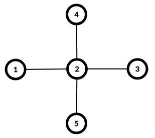

# CSP2021-训练-01

难度系数-$1640$​

**一．题目概况**

| 中文题目名称 |  Vasya和书  | Vova和奖杯 | 多学科竞赛 |  最大直径图  |  增频  |
| :----------: | :-------: | :---------: | :-------: | :----------: | :----------: |
| 可执行文件名 | book.cpp | trophies.cpp | compete.cpp | max.cpp | increase.cpp |
|  输入文件名  | book.in | trophies.in | compete.in | max.in | increase.in |
|  输出文件名  | book.out | trophies.out | compete.out | max.out | increase.out |
|   时间限制   |  2000ms  |   2000ms   |   2000ms   |  2000ms  |  2000ms  |
|   空间限制   | 256M   |   256M   |   256M   |   256M    |   256M   |

**二．注意事项：**
1、文件名（程序名和输入输出文件名）必须使用英文小写。
2、C/C++中函数main()的返回值类型必须是int，程序正常结束时的返回值必须是 0。
3、结果比较方式 ： 全文比较（过滤行末空格及文末回车）  。
4、特别提醒：评测在当前最新公布的 $NOI$ $Linux$ 下进行。
5、本次测试需要使用文件读写。

<div STYLE="page-break-after: always;"></div> 
## 1 Vasya和书  （book）
时间限制：$ 2 \ sec$​ ；空间限制：$256\  MB$​

### 题目描述

Vasya有一本 $n$ 页的电子书，她每次可以向前或向后翻 $d$ 页（但她不能翻到书外面去）。现在她要从第 x*x* 页翻到第 $y$ 页，求她最少翻的次数。

### 输入格式

输入第一行一个整数 $t (1\le t\le 10^3)$表示数据组数。

接下来 $t$ 行，每行 $4$ 个正整数 $n,x,y,d$ .$(1\le n,d \le 10^9,1\le x,y\le n)$.

### 输出格式

输出一个整数表示最少翻页次数，如果翻不到则输出 $-1$.

### **输入 #1**
```
3
10 4 5 2
5 1 3 4
20 4 19 3
```

### **输出 #1**
```
4
-1
5
```

### 数据范围

### 

对于$30\%$的数据

对于$100\%$的数据  $1\le t\le 10^3;$  $1\le n,d \le 10^9,1\le x,y\le n$

### 说明/提示

在第一个测试用例中，最佳序列是： $4 \rightarrow 2 \rightarrow 1 \rightarrow 3 \rightarrow 5$ 。

在第二个测试用例中，可以到达第 $1$ 页和第 $5$ 页。

在第三个测试用例中，最佳序列是： $4 \rightarrow 7 \rightarrow 10 \rightarrow 13 \rightarrow 16 \rightarrow 19 $ 。

<div STYLE="page-break-after: always;"></div> 

## 2 **Vova和奖杯**（trophies）
时间限制：$ 2 \ sec$​ ；空间限制：$256\  MB$​

### 题目描述

你现在有 $n$ 枚奖牌，每枚奖牌为金牌或银牌。这些奖牌现在按顺序排成一排。现在你可以调换任意一对奖牌的位置，求金牌最长连续段。

### 输入格式

第一行一个整数 $n (2\le n\le 10^5)$ .

第二行一行字符串，表示你的奖牌。 ( $\texttt{G} $ 表示金牌，$\texttt{S}$ 表示银牌)

### 输出格式

输出一个整数表示答案。

### **输入 #1**

```
10
GGGSGGGSGG
```

### **输出 #1**

```
7
```

### **输入 #2**

```
4
GGGG
```

### **输出 #2**

```
4
```

### **输入 #3**

```
3
SSS
```

### **输出 #3**

```
0
```

### 数据范围

对于$30\%$的数据

对于$100 \%$的数据  $2\le n\le 10^5$

### 说明/提示

在第一个例子中，Vova 必须交换索引为 $4$​​ 和 $10$​​ 的奖杯。因此他将获得序列"GGGGGGGSGS"，黄金奖杯的最长子段的长度为 $7$​​。

在第二个示例中，Vova 根本无法进行任何交换。 序列中最长的金奖杯子段的长度为 $4$。

在第三个示例中，Vova 无法使序列中最长的金奖杯子段的长度大于 $0$。

<div STYLE="page-break-after: always;"></div> 

## 3  **多学科竞赛**（compete）
时间限制：$2 \ sec$​ ；空间限制：$256\  MB$​

### 题目描述

现在有 $n$ 个人分成 $m$ 组，第 $ i$ 个人属于第 $s_i$ 组，能力值为 $r_i$ 。 现在你要选择任意一些组，在这些组中选择相同数目的人，最大化他们的能力值总和。

### 输入格式

第一行两个整数 $n , m (1\le n,m \le 10^5)$.

接下来 $n$ 行每行两个整数 $s_i , r_i$. $(1\le s_i \le m, |r_i|\le 10^4)$.

### 输出格式

输出一个整数表示最大的能力值总和。如果答案小于 $0$ , 输出 $0$  .

### **输入 #1**

```
6 3
2 6
3 6
2 5
3 5
1 9
3 1
```

### **输出 #1**

```
22
```

### **输入 #2**

```
5 3
2 6
3 6
2 5
3 5
1 11
```

### **输出 #2**

```
23
```

### **输入 #3**

```
5 2
1 -1
1 -5
2 -1
2 -1
1 -10
```

### **输出 #3**

```
0
```

### 数据范围

对于$30\%$的数据

对于$100\%$ 的数据  $1\le n,m \le 10^5;$  $1\le s_i \le m, |r_i|\le 10^4$

### 提示/说明

在第一个示例中，最佳选择候选 $1、2、3、4$，因此其中两个专注于第二主题，另外两个专注于第三主题。 总和为 $6+6+5+5=22$。

在第二个示例中，最佳选择候选人 $1、2$ 和 $5$。每个科目一个人，总和为 $6+6+11=23$。

在第三个示例中，不可能获得非负和。


## 4 最大直径图（max）

时间限制：$2 \ sec$​ ；空间限制：$256\  MB$​

### 题目描述

给你一个数列 $a_1,a_2,...,a_n$ ，构造一个 $n$ 个点的无向连通图，满足：

1. 没有重边和自环。
2. 第 $i$ 个点的度数 $\leq a_i$ .
3. 构建的图的直径尽可能长。

### 输入格式

第一行包含一个整数 $n（3≤n≤500）$​---图形中的顶点数。
第二行包含 $n$​ 个整数$a_1，a_2，…，a_n（1≤a_i≤n−1）$---顶点度的上限。

### 输出格式

如果在给定条件下无法构建图形，则打印“NO”。

否则在第一行打印“YES”和结果图的直径。

第二行应该包含一个整数 $m$——结果图中的边数。

接下来 $m$​ 行的第 $i$​ 行应该包含两个整数 $v_i,u_i (1≤v_i,u_i≤n, v_i≠u_i)$​——第 $i$​ 条边的描述。 该图不应包含多条边——对于您输出的每一对 $(x,y)$，您不应输出更多对 $(x,y)$ 或 $(y,x)$。

### **输入 #1**

```
3
2 2 2
```

### **输出 #1**

```
YES 2
2
1 2
2 3
```

### **输入 #2**

```
5
1 4 1 1 1
```

### **输出 #2**

```
YES 2
4
1 2
3 2
4 2
5 2
```

### **输入 #3**

```
3
1 1 1
```

### **输出 #3**

```
NO
```

### 数据范围

对于$30\%$的数据

对于 $100\%$ 的数据  $3≤n≤500;$  $1≤a_i≤n−1;$  $1≤v_i,u_i≤n, v_i≠u_i$

### 说明/提示

以下是前两个示例案例的图表。 两者的直径均为 $2$。


​				$d_1=1≤a_1=2d_1=1≤a_1=2$

​				$d_2=2≤a_2=2d_2=2≤a_2=2$

​				$d_3=1≤a_3=2$



​				$d_1=1≤a_1=1d_1=1≤a_1=1$

​				$d_2=4≤a_2=4d_2=4≤a_2=4$

​				$d_3=1≤a_3=1d_3=1≤a_3=1$

​				$d_4=1≤a_4=1d_4=1≤a_4=1$

## 5 增频（increase）

时间限制：$2 \ sec$​ ；空间限制：$256\  MB$​

### 题目描述

给你一个长度为 $n$ 的数列 $a$ ,你可以任意选择一个区间 $[l,r]$, 并给区间每个数加上一个整数 $k$, 求这样一次操作后数列中最多有多少个数等于 $c$.

### 输入格式

第一行两个整数 $n$, $c$ . 第二行 $n$ 个整数 $a_1,a_2,...,a_n$ .

$1\le n,c,a_i \le 5\cdot 10^5$ .

### 输出格式

输出一个整数表示答案。

### **输入 #1**

```
6 9
9 9 9 9 9 9
```

### **输出 #1**

```
6
```

### **输入 #2**

```
3 2
6 2 6
```

### **输出 #2**

```
2
```

### 数据范围

对于$30\%$的数据

对于 $100\%$ 的数据  $1\le n,c,a_i \le 5\cdot 10^5$

### 提示/说明

在第一个示例中，我们可以选择任何段和 $k = 0$ 。 数组将保持不变。

在第二个例子中，我们可以选择段 $[1, 3]$ 和 $k = -4$ 。 数组将变为 $[2, -2, 2]$


