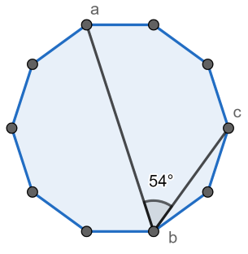

# CSP2021-训练-01

难度系数-$1375$​

**一．题目概况**

| 中文题目名称 |  查找可整除  | 子串删除 | 角度的多边形 |  简单问题  |
| :----------: | :-------: | :---------: | :-------: | :----------: |
| 可执行文件名 | find.cpp | removal.cpp | angle.cpp | problem.cpp |
|  输入文件名  | find.in | removal.in | angle.in | problem.in |
|  输出文件名  | find.out | removal.out | angle.out | problem.out |
|   时间限制   |  2000ms  |   1000ms   |   2000ms   |  2000ms  |
|   空间限制   | 256M   |   256M   |   256M   |   256M    |

**二．注意事项：**
1、文件名（程序名和输入输出文件名）必须使用英文小写。
2、C/C++中函数main()的返回值类型必须是int，程序正常结束时的返回值必须是 0。
3、结果比较方式 ： 全文比较（过滤行末空格及文末回车）  。
4、特别提醒：评测在当前最新公布的 $NOI$ $Linux$ 下进行。
5、本次测试需要使用文件读写。

<div STYLE="page-break-after: always;"></div> 
## 1 查找可整除  （find）
时间限制：$ 2 \ sec$​ ；空间限制：$256\  MB$​

### 题目描述

每次给你一个范围 $[l,r]$，你需要找到一对整数 $(x,y)$ 使得 $y$ 能够被 $x$ 整除，保证有解，$T$组询问。

### 输入格式

第一行包含一个整数 $T ( 1 \le T \le 1000 )$——查询的数量。

接下来的每一行都包含两个整数 $l$ 和 $r ( 1 \le l \le r \le 998244353 )$——包括范围的边界。

保证测试集只包含至少有一对合适的查询。

### 输出格式

打印 $T$ 行，每行应包含答案——两个整数 $x$ 和 $y$，使得 $l \le x$, $y \le r$ , $x \ne y$和 $x$​ 除以 $y$ 。 第 $i$ 行中的答案应对应于来自输入的第 $i$ 查询。

如果有多个答案，请打印其中任何一个。

### **输入 #1**
```
3
1 10
3 14
1 10
```

### **输出 #1**
```
1 7
3 9
5 10
```

### 数据范围

### 

对于$30\%$的数据

对于$100\%$​​的数据  $1 \le T \le 1000;$​​  $1 \le l \le r \le 998244353;$​​  $l \le x$​​,  $y \le r$​​ ,  $x \ne y$​​

<div STYLE="page-break-after: always;"></div> 

## 2 **子串删除**（removal）
时间限制：$ 1 \ sec$ ；空间限制：$256\  MB$

### 题目描述

给定一个长度为 $n$ 的字符串，请你从中去除一个子串，使得剩下的串要么为空，要么字符完全相同，输出方案数模 $998244353$

### 输入格式

第一行是字符串长度 $n$​

下面一行是一个长度为 $n$ 的字符串

### 输出格式

输出一行一个整数，代表答案对 $998244353$ 取模的结果

### **输入 #1**

```
4
abaa
```

### **输出 #1**

```
6
```

### **输入 #2**

```
7
aacdeee
```

### **输出 #2**

```
6
```

### **输入 #3**

```
2
az
```

### **输出 #3**

```
3
```

### 数据范围

对于$30\%$的数据

对于$100 \%$​​的数据  $2 ≤ n ≤ 2 × 10^5$​​;​

保证给出的字符串全是小写字母且至少含有两种字符

### 说明/提示

让 $s[l; r]$ 是 $s$ 从位置 $l$ 到位置 $r$ 的子串。

然后在第一个示例中，您可以删除以下子字符串：

$s[1; 2]$​ ;
$s[1; 3]$​ ;
$s[1; 4]$​ ;
$s[2; 2]$​ ;
$s[2; 3]$​ ;
$s[2; 4]$​ 。
在第二个示例中，您可以删除以下子字符串：

$s[1; 4]$ ;
$s[1; 5]$ ;
$s[1; 6]$ ;
$s[1; 7]$ ;
$s[2; 7]$ ;
$s[3; 7]$​ 。
在第三个示例中，您可以删除以下子字符串：

$s[1; 1]$ ;
$s[1; 2]$ ;
$s[2; 2]$ 。

<div STYLE="page-break-after: always;"></div> 

## 3  **角度的多边形**（angle）
时间限制：$2 \ sec$​ ；空间限制：$256\  MB$​

### 题目描述

给定一个角度 $\theta$​，请你寻找一个正 $ n$​ 边型，满足在这个正 n 边型上找三个顶点 $A,B,C$ （可以不相邻），使得 $\angle ABC~=~\theta$ 。请输出最小的 $n$。保证 $n$ 不超过 $998244353$。多组数据。

注意给出的 $\theta$ 是使用角度制表示的。

### 输入格式

第一行是数据组数 $T$

下面 $T$ 行，每行一个整数 $\theta$，代表给出的角度

### 输出格式

对于每组数据输出一行代表答案

### **输入 #1**

```
4
54
50
2
178
```

### **输出 #1**

```
10
18
90
180
```

### 数据范围

对于$30\%$的数据

对于$100\%$​ 的数据  $1 ≤ T ≤ 180 , 1 ≤ θ < 180$​​。

### 提示/说明

第一个查询的答案在下图。



第二个查询的答案是通过常规的 $18 -gon$ 获得的。 例如，$\angle{v_2 v_1 v_6} = 50^{\circ}$.

第三个查询的示例角度是 $\angle{v_{11} v_{10} v_{12}} = 2^{\circ}$.

在第四个查询中，最小可能的 $n$ 是 $180$ （不是 $90$ ）。


## 4 简单问题（problem）

时间限制：$2 \ sec$​ ；空间限制：$256\  MB$​

### 题目描述

给你一个长为 $n$ 的字符串 $s$ 以及 $a_{1..n}$，删去第 $i$ 个字符的代价为 $a_i$，你需要删去一些字符（如果一开始就符合条件当然可以不删）使得剩下的串中不含子序列 "hard"，求最小代价。

子序列不需要连续。

### 输入格式

第一行包含一个整数 $n ( 1 \le n \le 10^5)$ — 语句的长度。

第二行包含一个长度为 $n$ 的字符串 $s$ ，由小写拉丁字母组成——这是 Vasya 写的语句。

第三行包含 $n$​个整数 $a_1、a_2、\dots、a_n( 1 \le a_i \le 998244353）$​。

### 输出格式

在 Vasya 删除一些（可能为零）字符后打印语句的最小可能歧义，因此结果语句很容易。

### **输入 #1**

```
6
hhardh
3 2 9 11 7 1
```

### **输出 #1**

```
5
```

### **输入 #2**

```
8
hhzarwde
3 2 6 9 4 8 7 1
```

### **输出 #2**

```
4
```

### **输入 #3**

```
6
hhaarr
1 2 3 4 5 6
```

### **输出 #3**

```
0
```

### 数据范围

对于$30\%$的数据

对于 $100\%$ 的数据  $1 \le n \le 10^5;$  $1 \le a_i \le 998244353$

### 说明/提示

在第一个示例中，删除了前两个字符，因此结果为 $ardh$。

在第二个示例中，第 $5$ 个字符被删除，因此结果是 $hhzawde$。

在第三个示例中，无需删除任何内容。

