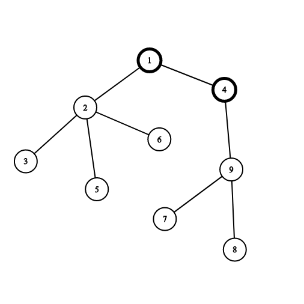

# CSP2021-训练-01

难度系数-$1525$

**一．题目概况**

| 中文题目名称 |    贴纸和玩具    | 书信店 | Vasya和Array |  树的画  |
| :----------: | :-------: | :---------: | :-------: | :----------: |
| 可执行文件名 | toys.cpp | shop.cpp | game.cpp | tree.cpp |
|  输入文件名  | toys.in | shop.in | game.in | tree.in |
|  输出文件名  | toys.out | shop.out | game.out | tree.out |
|   时间限制   |  2000ms  |   2000ms   |   1000ms   |  2000ms   |
|   空间限制   | 256M   |   256M   |   256M   |   256M    |

**二．注意事项：**
1、文件名（程序名和输入输出文件名）必须使用英文小写。
2、C/C++中函数main()的返回值类型必须是int，程序正常结束时的返回值必须是 0。
3、结果比较方式 ： 全文比较（过滤行末空格及文末回车）  。
4、特别提醒：评测在当前最新公布的 $NOI$ $Linux$ 下进行。
5、本次测试需要使用文件读写。

<div STYLE="page-break-after: always;"></div> 
## 1 贴纸和玩具  （toys）
时间限制：$ 2 \ sec$ ；空间限制：$256\  MB$

### 题目描述

商店卖$n$个蛋，有$s$个棍子和$t$个玩具藏在蛋里。

每个蛋有三种情况：

有一个棍子

有一个玩具

有一个棍子$+$一个玩具。

输出最多买几个蛋时，你会有至少一个棍子和玩具。

T组询问

### 输入格式

第一行包含单个整数 $T ( 1 \le T \le 100 ) $— 查询次数。

接下来的 $T$ 行分别包含三个整数$ n  、  s$ 和$ t ( 1 \le n \le 10^9, 1 \le s, t \le n, s + t \ge n) $— 鸡蛋、贴纸和玩具的数量。

所有查询都是独立的。

### 输出格式

打印$ T$整数（每个查询一个数字）——您必须购买的 Kinder Surprise Eggs 的最小数量，以确保无论它们是哪种类型，您至少会获得一张贴纸和一个玩具

### **输入 #1**
```
3
10 5 7
10 10 10
2 1 1
```

### **输出 #1**
```
6
1
2
```

### 数据范围

### 

对于$30\%$的数据

对于$100\%$的数据$1 \le T \le 100;$ $1 \le n \le 10^9, 1 \le s, t \le n, s + t \ge n$

### 说明/提示

在第一个查询中，我们必须至少取 $6$ 个鸡蛋，因为里面只有 $5$ 个鸡蛋，而且在最坏的情况下，我们会全部购买。

在第二个查询中，所有鸡蛋里面都有贴纸和玩具，这就是为什么只买一个鸡蛋就足够了。

在第三个查询中，我们必须购买两个鸡蛋：一个带有贴纸，一个带有玩具。

<div STYLE="page-break-after: always;"></div> 

## 2 **书信店**（shop）
时间限制：$ 2 \ sec$ ；空间限制：$256\  MB$

### 题目描述

字母商店的橱窗其实是一个由 $n$ 个小写字母组成的字符串 $s$！店如其名，这家店就是卖字母的。

字母商店卖的东西很奇怪，卖的方式更奇怪，它只从左往右卖，意思是说，你只能买这个字符串 $s$ 的前缀。

你有 $m$ 个好基友，第  $i $ 个的名字叫做 $ t_i$ 。他们听说了这家店，都打算来买点字母，来拼出自己的名字，当然买来的字母是可以被打乱顺序或者干脆不用的。他们都想知道至少要买下几个字母才能拼出自己的名字。

举几个例子

- $s="arrayhead" , t_i="arya"$时，必须买下$"\underline{array}head"$ 5个字母
- $s="arrayhead" , t_i="harry"$时，必须买下$"\underline{arrayh}ead"$ 6个字母
- $s="arrayhead" , t_i="ray"$时，必须买下$"\underline{array}head"$ 5个字母
- $s="arrayhead" , t_i="r"$时，必须买下$"\underline{ar}rayhead"$ 2个字母
- $s="arrayhead" , t_i="areahydra"$时，必须买下$"\underline{arrayhead}"$ 9个字母

字母商店的字母很齐全，所有的朋友肯定都能拼出自己的名字。

要注意的是，你的朋友们都只是在Doing [window shopping](https://baike.baidu.com/item/橱窗购物/9473660?fr=aladdin&fromid=8209896&fromtitle=Window+shopping)。他们只要你帮他们算出答案，并不会真正买下这些字母。

### 输入格式

第一行是一个整数 $n(1\leq n \leq 2 \times10^5)$表示橱窗 $s$ 的长度

第二行是字符串 $s$

第三行一个整数 $m(1 \leq m \leq 5 \times10^4) $表示你的朋友个数

此后 $m$行 ,每一行有一个字符串$ t_i(1 \leq |t_i| \leq 2 \times 10^5)$

你的朋友都很正常，所以他们名字总长度不会超过$2\times10^5$

### 输出格式

共$m$行，第 $i$ 行对于第 $i$ 个朋友的询问输出他至少要买下几个字母才能拼出自己的名字。

### **输入 #1**

```
9
arrayhead
5
arya
harry
ray
r
areahydra
```

### **输出 #1**

```
5
6
5
2
9
```

### 数据范围

对于$30\%$的数据

对于$100 \%$的数据$1\leq n \leq 2 \times10^5;$ $1 \leq m \leq 5 \times10^4;$$1 \leq |t_i| \leq 2 \times 10^5;$ 名字总长度不超过$2\times10^5$


## 3  **Vasya和Array**（game）
时间限制：$1 \ sec$ ；空间限制：$256\  MB$

### 题目描述

`Vasya`有一个数组$a[1...n]$

你从来没听说过这个数组，但`Vasya`会告诉你 m 条关于这个数组的信息。每条信息包含三个参数$t_i,l_i,r_i(0\leq t_i \leq 1 ,1 \leq l_i < r_i \leq n)$，其含义分别为：

- 如果 $ t_i=1$ 则说明子数组$a[l_i...r_i]$ 是一个不降序列
- 如果 $t_i=0$ 则说明子数组$a[l_i...r_i] $ 不是一个不降序列。一个数组 $a $ **不是一个不降序列**说明存在两个相邻元素$a[i] ,a[i+1]$使得$a[i]>a[i+1]$

举个栗子：假设$a=[2,1,1,3,2]$ ，然后 `Vasya` 告诉你：

$t_1=1,l_1=2,r_1=4$，意思是 $a[2...4]=[1,1,3]$是一个不降序列

$t_1=0,l_1=4,r_1=5$，意思是 $a[4...5]=[3,2]$ 不是一个不降序列 

$t_1=0,l_1=3,r_1=5$，意思是 $a[4...5]=[1,3,2]$不是一个不降序列

然而就算`Vasya` 告诉你这么多条件，你依然不会知道数组 $a$，但是请你找出一种可能的情况。

### 输入格式

第一行有两个整数$n,m(2\leq n\leq 1000 ,1 \leq m \leq 1000)$

接下来 $m$行每一行有三个整数 $t_i,l_i,r_i$ 表示一条信息，含义见题目描述

### 输出格式

如果`Vasya`自相矛盾，只需输出`NO`

如果有解，请先输出`YES`，之后输出 $n$ 个整数 $a_1,a_2...,a_n(1\leq a_i \leq 10^9)$。有多组解请任意输出一种。

### **输入 #1**

```
7 4
1 1 3
1 2 5
0 5 6
1 6 7
```

### **输出 #1**

```
YES
1 2 2 3 5 4 4
```

### **输入 #2**

```
4 2
1 1 4
0 2 3
```

### **输出 #2**

```
NO
```

### 数据范围

对于$30\%$的数据

对于$100\%$ 的数据 $0\leq t_i \leq 1 ,1 \leq l_i < r_i \leq n;$ $2\leq n\leq 1000 ,1 \leq m \leq 1000;$ $1\leq a_i \leq 10^9$


## 4 **树的画**（tree）

时间限制：$2 \ sec$ ；空间限制：$256\  MB$

### 题目描述

给定一棵$n$个点的树 初始全是白点

要求你做$n$步操作，每一次选定一个与一个黑点相隔一条边的白点，将它染成黑点，然后获得该白点被染色前所在的白色联通块大小的权值。

第一次操作可以任意选点。

求可获得的最大权值

### 输入格式

第一行包含一个整数 $n $ — 树中的顶点数 $( 2 \le n \le 2 \cdot 10^5）$。

接下来的 $n - 1$ 行中的每一行都描述了树的一条边。 边 $i $ 由两个整数 $u_i$ 和 $ v_i$，表示它连接的顶点的索引 $( 1 \le u_i, v_i \le n,, u_i \ne v_i）$。

保证给定的边形成一棵树。

### 输出格式

打印一个整数——如果您以最佳方式玩游戏，您获得的最大积分数。

### **输入 #1**

```
9
1 2
2 3
2 5
2 6
1 4
4 9
9 7
9 8
```

### **输出 #1**

```
36
```

### **输入 #2**

```
5
1 2
1 3
2 4
2 5
```

### **输出 #2**

```
14
```

### 数据范围

对于$30\%$的数据

对于 $100\%$ 的数据,$1\le n\le3\times10^5;$ $-100\le x\le100;$ $ -10^9\le a_i\le10^9$

### 说明/提示

让我们看示例一：




顶点 $1$ 和 $4$ 已经涂成黑色。 如果选择顶点 $2$ ，则由顶点 $2、3、5$ 和 $6$ 组成的连接组件将获得 $4$ 个点。 如果选择顶点 $9$ ，则由顶点 $7、8$和 $9$ 组成的连接组件将获得 $3 $ 分。


