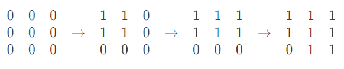
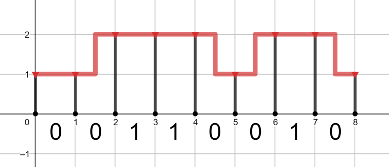
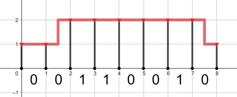
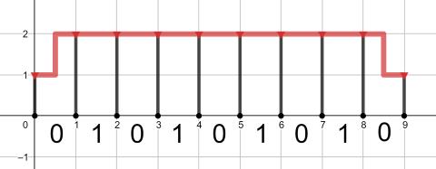
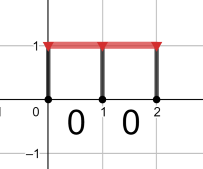

# CSP2021-训练-01

难度系数-$1550$

**一．题目概况**

| 中文题目名称 |  两种汉堡  | 填方格 | 燃气管道 |  排列数  | 异或猜测 | 剩余问题 |
| :----------: | :-------: | :---------: | :-------: | :----------: | :----------: | ------------ |
| 可执行文件名 | burgers.cpp | square.cpp | gas.cpp | number.cpp | guess.cpp | problem.cpp |
|  输入文件名  | burgers.in | square.in | gas.in | number.in | guess.in | problem.in |
|  输出文件名  | burgers.out | square.out | gas.out | number.out | guess.out | problem.out |
|   时间限制   |  1000ms  |   1000ms   |   2000ms   |  2000ms   | 1000ms | 4000ms |
|   空间限制   | 256M   |   256M   |   256M   |   256M    | 256M | 512M |

**二．注意事项：**
1、文件名（程序名和输入输出文件名）必须使用英文小写。
2、C/C++中函数main()的返回值类型必须是int，程序正常结束时的返回值必须是 0。
3、结果比较方式 ： 全文比较（过滤行末空格及文末回车）  。
4、特别提醒：评测在当前最新公布的 $NOI$ $Linux$ 下进行。
5、本次测试需要使用文件读写。

<div STYLE="page-break-after: always;"></div> 
## 1 两种汉堡  （burgers）
时间限制：$ 1 \ sec$ ；空间限制：$256\  MB$

### 题目描述

在你的餐厅里有两种汉堡：牛肉汉堡和鸡肉汉堡。每个牛肉汉堡需要$2$片面包和$1$片牛肉，一个鸡肉汉堡需要$2$片面包和$1$个鸡排。

一个牛肉汉堡卖$h$元，一个鸡肉汉堡卖$c$元。

你有$b$片面包，$p$片牛肉和$f$块鸡排。求最大收益。

### 输入格式

第一行，$t$，表示数据组数。$1\leqslant t \leqslant 100$

对于每一组数据：第一行，三个整数$b,p,f(1\leqslant b,p,f \leqslant 100)$

第二行，两个整数$h,c(1 \leqslant h,c \leqslant 100)$

### 输出格式

对于每一组数据，输出最大收益。

### **输入 #1**
```
3
15 2 3
5 10
7 5 2
10 12
1 100 100
100 100
```

### **输出 #1**
```
40
34
0
```

### 数据范围

### 

对于$30\%$的数据

对于$100\%$的数据$1\leqslant t \leqslant 100;$ $1\leqslant b,p,f \leqslant 100;$ $1 \leqslant h,c \leqslant 100$

### 说明/提示

在第一个查询中，您必须出售两个汉堡包和三个鸡肉汉堡。 你的收入是 $2 \cdot 5 + 3 \cdot 10 = 40$。

在第二个查询中，您必须 ell 一个汉堡包和两个鸡肉汉堡。 你的收入是$ 1 \cdot 10 + 2 \cdot 12 = 34$

在第三个查询中，您不能创建任何类型的汉堡，因为您只有一个小圆面包。 所以你的收入为零。

<div STYLE="page-break-after: always;"></div> 

## 2 **填方格**（square）
时间限制：$ 1 \ sec$ ；空间限制：$256\  MB$

### 题目描述

给定一个全零的$n×m$矩阵，每次可以选定一个点$(x,y)|1≤x<n,1≤y<m$，把$(x,y)(x+1,y)(x,y+1)(x+1,y+1)$均改成$1$，求一个操作序列把这个全零矩阵转化为目标矩阵，你不必最小化步骤
$2≤n,m≤50$，所以你的操作数量最多为$2500$
输入$n,m$和该目标矩阵，若不存在合法方案，输出$-1$
否则先输出操作数量，然后每行输出$(x_i,y_i)$，表示本次操作选中$(x,y)$

### 输入格式

第一行包含两个整数 $n$ 和 $m ( 2 \le n, m \le 50 )$。

然后是 $n$ 行，每行包含 $m$ 个整数。 第 $i$ 行中的第$ j$ 个整数是$ A_{i, j}$. 每个整数是$ 0$ 或 $1$ 。

### 输出格式

如果不可能使 $B$ 等于 $A$ ，则打印一个整数 $-1$ 。

否则，按以下格式打印将 $B$ 转换为 $A$ 的任何操作序列：第一行应包含一个整数 $k$ — 操作的数量，然后应遵循 $k$ 行，每行包含两个整数 $x$ 和 $y$，用于对应的操作 （设置 $B_{x, y}, B_{x, y + 1}, B_{x + 1, y}$和 $B_{x + 1, y + 1}$到 $1$）。 条件 $0 \le k \le 2500$ 应该成立。

### **输入 #1**

```
3 3
1 1 1
1 1 1
0 1 1
```

### **输出 #1**

```
3
1 1
1 2
2 2
```

### **输入 #2**

```
3 3
1 0 1
1 0 1
0 0 0
```

### **输出 #2**

```
-1
```

### **输入 #3**

```
3 2
0 0
0 0
0 0
```

### **输出 #3**

```
0
```

### 数据范围

对于$30\%$的数据

对于$100 \%$的数据$1≤x<n,1≤y<m; $ $2 \le n, m \le 50;$  $0 \le k \le 2500$

### 说明/提示

第一个例子中的操作顺序：



<div STYLE="page-break-after: always;"></div> 

## 3  **燃气管道**（gas）
时间限制：$2 \ sec$ ；空间限制：$256\  MB$

### 题目描述

你需要在城市里修建管道和支柱，管道和支柱的单位长度的价格分别为$a,b$

给你一个长度为$n$的$01$序列，其中$1$表示这里需要通车，$0$表示这里不需要通车，高度为$2$的地方才可以通车(保证序列的头尾不需要通车)

如图，红色表示管道，黑色表示支柱，我们可以在一段单位区间建立一条S形线条，每个S形可以表示为该段由三部分组成：$0.5$个单位的水平管道$+1$个单位的垂直管道$+0.5$个单位的水平管道

每一段的单位区间左右都有支柱支撑，支柱的高度等于管道端点的高度

你需要保证所有通车的地方高度为$2$的同时，建管道和支柱的费用总和最小

### 输入格式

第一行包含一个整数 $T ( 1 \le T \le 100 )$——查询的数量。 接下来的 $2 \cdot T$ 行包含独立的查询——每两行一个查询。

第一行包含三个整数 $n , a , b ( 2 \le n \le 2 \cdot 10^5, 1 \le a \le 10^8, 1 \le b \le 10^8)$——道路长度、单位管道的成本和单位支柱的成本。

第二行包含二进制字符串 $s ( |s| = n , s_i \in \{0, 1\}, s_1 = s_n = 0) $— 道路的描述。

保证所有字符串 $s$  的总长度不超过 $2 \cdot 10^5$ .

### 输出格式

打印$ T$ 整数——每个查询一个。 对于每个查询，打印构建管道的最低可能成本。

### **输入 #1**

```
4
8 2 5
00110010
8 1 1
00110010
9 100000000 100000000
010101010
2 5 1
00
```

### **输出 #1**

```
94
25
2900000000
13
```

### 数据范围

对于$30\%$的数据

对于$100\%$ 的数据$1 \le T \le 100;$   $2 \le n \le 2 \cdot 10^5, 1 \le a \le 10^8, 1 \le b \le 10^8;$   $|s| = n , s_i \in \{0, 1\}, s_1 = s_n = 0;$  字符串 $s$  的总长度不超过 $2 \cdot 10^5$ .

### 说明/提示

第一个查询的最佳管道如下图所示：



第二个查询的最佳管道如下图所示：



第三个查询的最佳（也是唯一可能的）管道如下所示：



第四个查询的最佳管道如下所示：




## 4 排列数（number）

时间限制：$2 \ sec$ ；空间限制：$256\  MB$

### 题目描述

给出一个由$n$个整数二元组组成的序列：$(a_1, b_1), (a_2, b_2), \dots , (a_n, b_n)$。我们称这个序列是**坏的**，当且仅当这个序列中每个二元组的第一个元素是所组成的数列是**单调不减**或这个序列中每个二元组的第二个元素是所组成的数列是**单调不减**的。否则，我们称这个序列是**好的**。下面给出了几个好序列和坏序列的例子：

$s = [(1, 2), (3, 2), (3, 1)]$ 是一个**坏序列**，因为序列中每个二元组的第一个元素所组成的数列是排好序的：$[1, 3, 3]$；

$s = [(1, 2), (3, 2), (1, 2)]$ 是一个**坏序列**，因为序列中每个二元组的第二个元素所组成的数列是排好序的：$[2, 2, 2]$；

$s = [(1, 1), (2, 2), (3, 3)]$ 是一个**坏序列**，因为序列中每个二元组的第一个元素所组成的数列和第二个元素所组成的数列都是排好序的；

$s = [(1, 3), (3, 3), (2, 2)]$ 是一个**好序列**，因为序列中每个二元组的第一个元素所组成的数列和第二个元素所组成的数列都是无序的（译注：“单调不减”（non-descending）可能比“无序（not sorted）”更合适）。

计算出大小为n的排列，使得经过排列操作后，二元组序列s能变成一个**好序列**。

一个大小为n的排列方式$p：p_1, p_2, \dots , p_n$，包含n个不重复的正整数$( 1 \le p_i \le n)$. 如果排列为$p_1, p_2, \dots , p_n$，在经过排列操作之后，序列会变为$s_{p_1}, s_{p_2}, \dots , s_{p_n}$。例如，如果序列$s = [(1, 2), (1, 3), (2, 3)]$，排列$p = [2, 3, 1]$，那么序列变为$[(1, 3), (2, 3), (1, 2)]$。

### 输入格式

第一行包含一个正整数 $n (1 \le n \le 3 \cdot 10^5)$.

接下来的$n$行描述了序列$s$。第$i$行包含两个整数$a_i$和$b_i（1 \le a_i, b_i \le n）$ ，表示序列$s$的第$i$个二元组的两个整数。

序列$s$中可能包含相同的二元组。

### 输出格式

输出符合题意的大小为$n$的排列的方案数，使得经过这些排列中的任何一个的排列操作之后，序列$s$会成为一个**好序列**。答案对$99824353$取模（一个质数）。

### **输入 #1**

```
3
1 1
2 2
3 1
```

### **输出 #1**

```
3
```

### **输入 #2**

```
4
2 3
2 2
2 1
2 4
```

### **输出 #2**

```
0
```

### **输入 #3**

```
3
1 1
1 1
2 3
```

### **输出 #3**

```
4
```

### 数据范围

对于$30\%$的数据

对于 $100\%$ 的数据 $1 \le p_i \le n;$   $1 \le n \le 3 \cdot 10^5;$  $1 \le a_i, b_i \le n$

### 说明/提示

在第一个测试用例中，有六个大小为  $3$  的排列：

如果 $p = [1, 2, 3]$ ，则 $s = [(1, 1), (2, 2), (3, 1)]$ — 坏序列（按第一个元素排序）；
如果 $p = [1, 3, 2]$ ，则 $s = [(1, 1), (3, 1), (2, 2)]$ — 坏序列（按第二个元素排序）；
如果 $ p = [2, 1, 3]$ ，则 $s = [(2, 2), (1, 1), (3, 1)]$ — 良好的序列；
如果 $p = [2, 3, 1]$ ，则 $s = [(2, 2), (3, 1), (1, 1)]$ — 良好的序列；
如果 $p = [3, 1, 2]$ ，则 $s = [(3, 1), (1, 1), (2, 2)]$ — 坏序列（按第二个元素排序）；
如果 $p = [3, 2, 1]$ ，则 $s = [(3, 1), (2, 2), (1, 1)]$ — 良好的序列。

## 5 **异或猜测**（guess）

时间限制：$1 \ sec$ ；空间限制：$256\  MB$

### 题目描述

为了刷新你的输出，要使用 `fflush(stdout)` (对于C++)。

$\mathsf E \color{red} \mathsf{ntropyIncreaser}$ 随便想了一个在 $[0,2^{14}-1]$ 范围内的整数 $x$，你要猜出它是多少。

你可以进行至多两次询问，每次输出 $100$ 个 $[0,2^{14}-1] $范围内的整数 $a_1,a_2,...a_{100}$ 。需要注意的是，你输出的所有数必须两两不同。

作为回复，$\mathsf E \color{red} \mathsf{ntropyIncreaser}$ 会从你的每次输出中选一个数(你并不知道她选了哪个)，告诉你 $x$ 与其按异或的结果。

### 输入格式

这是交互题，并没有输入格式。

### 输出格式

当输出答案时，需要以 $ !\space x$ 并加一个换行符的形式结束。

### 交互

当你询问时，需要以 $?\space a_1 \space a_2 ...\space a_{100}$ 的并加一个换行符的形式。在输出询问之后，刷新输出再读入，就能得到询问的答案。

如果你给出了一个非法的询问，或询问超过两次，你只会得到 $-1$ 作为结果。此时，你的程序应当立即终止。

### 说明/提示

注意：样例输出是 **不正确的**。你的每次询问必须输出刚好 $100$ 的整数。

### **输入 #1**

```
0
32
```

### **输出 #1**

```
? 3 5 6
? 32 24 37
! 5
```

### 数据范围

对于$30\%$的数据

对于 $100\%$ 的数据$0<x<2^{14}-1;$  $0<a<2^{14}-1;$  


## 6 **排列问题**（problem）

时间限制：$4 \ sec$ ；空间限制：$512\  MB$

### 题目描述

给你一个长度为 $500000$ 的序列，初值为 $0$ ，你要完成 $q$ 次操作，操作有如下两种：

1. `1 x y` : 将下标为 $x$ 的位置的值加上 $y$
2. `2 x y` : 询问所有下标模 $x$ 的结果为 $y$ 的位置的值之和

### 输入格式

第一行一个整数 $q $ ，表示操作数。$(q\leqslant500000)$
接下来 $q$ 行，每行三个整数 $t,x,y$ 表示一次操作。$(t\in\{1,2\})$
若 $ t=1$ 则为第一种操作，保证：
$1\leqslant x\leqslant500000,-1000\leqslant y\leqslant1000$
若 $t=2$ 则为第二种操作，保证：
$1\leqslant x\leqslant500000,0\leqslant y<x$
数据保证至少有一个操作 $2$ 。

### 输出格式

每行对于每个操作 $2$ 输出一个整数表示答案。

### **输入 #1**

```
5
1 3 4
2 3 0
2 4 3
1 4 -4
2 1 0
```

### **输出 #1**

```
4
4
0
```

### 数据范围

对于$30\%$的数据

对于 $100\%$ 的数据$q\leqslant500000;$  $t\in\{1,2\};$  若 $ t=1,1\leqslant x\leqslant500000,-1000\leqslant y\leqslant1000；$ 若$t=2,1\leqslant x\leqslant500000,0\leqslant y<x$


