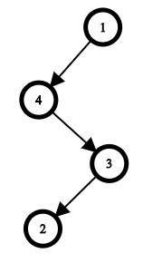
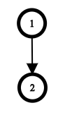
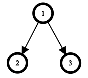

# CSP2021-训练-01

难度系数-$26.4$

**一．题目概况**

| 中文题目名称 |    营销方案    | 逆二进制串 | 大厨Monocrap | 最小高度树 |
| :----------: | :-------: | :---------: | :-------: | :----------: |
| 可执行文件名 | scheme.cpp | binary.cpp | chef.cpp | tree.cpp |
|  输入文件名  | scheme.in | binary.in | chef.in | tree.in |
|  输出文件名  | scheme.out | binary.out | chef.out | tree.out |
|   时间限制   |  1000ms   |   2000ms   |  2000ms   | 2000ms |
|   空间限制   | 256M   |   256M   |   256M    | 256M |

**二．注意事项：**
1、文件名（程序名和输入输出文件名）必须使用英文小写。
2、C/C++中函数main()的返回值类型必须是int，程序正常结束时的返回值必须是 0。
3、结果比较方式 ： 全文比较（过滤行末空格及文末回车）  。
4、特别提醒：评测在当前最新公布的 $NOI$ $Linux$ 下进行。
5、本次测试需要使用文件读写。

<div STYLE="page-break-after: always;"></div> 
## 1 营销方案（Marketing Scheme）
时间限制：$1 \ sec$ ；空间限制：$256\  MB$

### 题目描述

- ∃*x*, 对于$\forall i \in [l,r]$，要求$i\ mod\ x \geq \frac{x}{2}$,判断是否存在这样的$x$

### 输入格式

第一行包含一个整数$ t (1≤t≤1000)$——测试用例的数量。

每个测试用例的第一行也是唯一一行包含两个整数$ l $和$ r (1≤l≤r≤10^{9})$——客户可以购买的罐头数量范围。

### 输出格式

对于每个测试用例，如果您可以选择包装 $a $的大小，使每个客户购买的罐头数量超过他们最初想要的数量，则打印 $YES$。 否则，打印$ NO$。

您可以在任何情况下打印每个字符。

### **输入 #1**
```
3
3 4
1 2
120 150
```

### **输出 #1**
```
YES
NO
YES
```

### 数据范围

### 

对于$100\%$的数据满足$1≤t≤1000; 1≤l≤r≤10^{9}.$

### 说明/提示

在第一个测试用例中，例如可以将 $a = 5$作为包的大小。 那么如果客户想买 33 罐，他会买 55 罐（$ 3 \bmod 5 = 3 , \frac{5}{2} = 2.5$)​。 想要 $4$ 罐的人也将购买$ 5$ 罐。

在第二个测试用例中，没有办法选择 $a$ 。

例如，在第三个测试用例中，您可以采用$ a = 80$ 。


<div STYLE="page-break-after: always;"></div> 

## 2 逆二进制串（Reverse Binary Strings)


时间限制：$ 2 \ sec$ ；空间限制：$256\  MB$

### 题目描述

给定一个长度为偶数的$01$串，每次可以选定一个子串进行翻转操作。要求最后翻转成一个$0,1$交替的串（只有$0101\dots01$和$1010\dots10$类型的串是合法的串）。求最少的操作次数。

### 输入格式

第一行包含一个整数$ t ( 1 \le t \le 1000 ) $— 表示测试用例的数量。

每个测试用例的第一行包含一个整数 $n($ $2 \le n \le 10^5;$ $n$是偶数$) $— 表示字符串 $s$ 的长度。

每个测试用例的第二行包含一个长度为$n( s_i ∈ ${0, 1}$)$。 字符串$ s$正好有 $\frac{n}{2}$个$0$和 $\frac{n}{2}$个$1$。

保证测试用例的$n$总和不超过$10^5$


### 输出格式

对于每个测试用例，打印使$ s $交替的最小操作数。

### **输入 #1**

```
3
2
10
4
0110
8
11101000
```

### **输出 #1**

```
0
1
2
```

### 数据范围

对于$100 \%$的数据满足$1 \le t \le 1000 ;$ $2 \le n \le 10^5;$ $s_i ∈ ${0, 1}$; $$n$总和不超过$10^5$

<div STYLE="page-break-after: always;"></div> 

## 3  大厨Monocrap（Chef Monocarp）
时间限制：$2 \ sec$ ；空间限制：$256\  MB$

### 题目描述

有$n$到菜品被放入了一个烤炉中，每到菜品都有一个最佳取出的时间$t_i$。现在按照一定顺序把菜品从烤炉中取出，每到菜品都有可能因为不在最佳时间被取出而造成不美味，定义这个不美味度为$|T-t_i|$，其中$T$是取出的时刻。求把所有菜品都取出来的最小不美味度。

### 输入格式

第一行包含一个整数 $q (1≤q≤200)$——测试用例的数量。

然后是$ q $个测试用例。

测试用例的第一行包含一个整数$ n (1≤n≤200)$——烤箱中的菜肴数量。

测试用例的第二行包含 $n$ 个整数 $t_1,t_2,…,t_n (1≤t_i≤n)$——每道菜的最佳烹饪时间。

所有 $q $个测试用例的 $n $之和不超过 $200$。

### 输出格式

为每个测试用例打印一个整数——当 $Monocarp $把所有的盘子从烤箱里拿出来时，他可以获得的最小总令人不快的值。 请记住$ Monocarp $只能在正整数分钟内出菜，并且在任何分钟内最多只能出一道菜。

### **输入 #1**

```
6
6
4 2 4 4 5 2
7
7 7 7 7 7 7 7
1
1
5
5 1 2 4 3
4
1 4 4 4
21
21 8 1 4 1 5 21 1 8 21 11 21 11 3 12 8 19 15 9 11 13
```

### **输出 #1**

```
4
12
0
0
2
21
```

### 数据范围

对于 $100\%$ 的数据，$1≤q≤200;$ $1≤n≤200;$ $1≤t_i≤n;$ $q$个测试的$n$不超过$200$

### 说明/提示

在第一个示例中，$ Monocarp $可以在 $3、1、5、4、6、2 $分钟时取出菜肴。 这样总的不愉快值将是 $|4-3|+|2-1|+|4-5|+|4-4|+|6-5|+|2-2|=4$。

在第二个示例中， $Monocarp $可以在 $4、5、6、7、8、9、10 $分钟时取出菜肴。

在第三个例子中， $Monocarp $可以在第 $1 $分钟取出菜。

在第四个例子中， $Monocarp$ 可以在第$ 5、1、2、4、3 $分钟放出盘子。

在第五个例子中， $Monocarp$ 可以在$ 1、3、4、5$ 分钟时放出盘子。

## 4 最小高度树（Minimal Height Tree)

时间限制：$2 \ sec$ ；空间限制：$256\  MB$

### 题目描述

$Monocarp$有一颗以结点$ 1$为根结点的树。他打算学习BFS（此处是能打开的OI Wiki，内有C++伪代码，原链接在上面的题面中[Breadth-first search](https://oi-wiki.org/graph/bfs/)），所以他对这颗树从根结点开始进行了BFS。BFS的伪代码如下（我就修一下题面 C++的伪代码去wiki看吧）：

```c++
a = [] # the order in which vertices were processed
    # 结点被遍历的顺序
q = Queue()
q.put(1) # place the root at the end of the queue
    # 把根结点放入队尾
while not q.empty():
    k = q.pop() # retrieve the first vertex from the queue
        # 取出队首元素append
    a.append(k) # append k to the end of the sequence in which vertices were visited
        # 将k放入已被遍历的序列末尾
    for y in g[k]: # g[k] is the list of all children of vertex k, sorted in ascending order
        # 意思是 ：g[k]存有 k 的全部子结点，且按升序排列
        q.put(y)
```

$Monocarp$沉迷BFS无法自拔，最后把自己的树给搞丢了，只留下了一个BFS序列 $a$。Monocarp知道每个结点只被遍历一次（因为他们只入队和出队一次），并且知道每个结点的子结点是按升序遍历的。

$Monocarp$知道不同的树可能有相同的BFS序列，因此他不期待能够找回原来的树，他只想得到根据BFS序列能得到的高度最小的树。

树的高度是树中结点的最大深度。一个结点的深度为从根结点到达它的路径上的边的数量。比如，结点 $1$ 的深度是$ 0$，因为它是根结点，所以他的所有子节点的深度都是$ 1$。

请根据给出的 $a$ 序列帮助$ Monocarp $找到高度最小的树。

### 输入格式

第一行一个整数 $t\,(1\le t\le 1000)$，表示有$ t$ 组测试数据。

每一组测试数据的的一行有一个整数 $n(a\le n\le 2\,·\!10^5)$，表示树中结点个数。

每组测试数据的第二行包含 $n$ 个整数 $a_1,a_2,\dots,a_n (1\le a_i \le n;a_i\ne a_j ;a_1=1)$。

所有测试数据中的 $n$ 的总和不超过 $2·\!10^5$。

### 输出格式

每行一个整数，表示树的最小高度

### **输入 #1**

```
3
4
1 4 3 2
2
1 2
3
1 2 3
```

### **输出 #1**

```
3
1
1
```

### 数据范围


对于 $100\%$ 的数据,$1\le t\le 1000;$ $a\le n\le 2\,·\!10^5;$ $1\le a_i \le n;a_i\ne a_j ;a_1=1;$  $n$ 的总和不超过 $2·\!10^5$


## 解释

在第一个测试用例中，只有一棵树具有给定的访问顺序：



在第二个测试用例中，只有一棵树具有给定的访问顺序：



在第三个测试用例中，具有给定访问顺序的最佳树如下所示：


